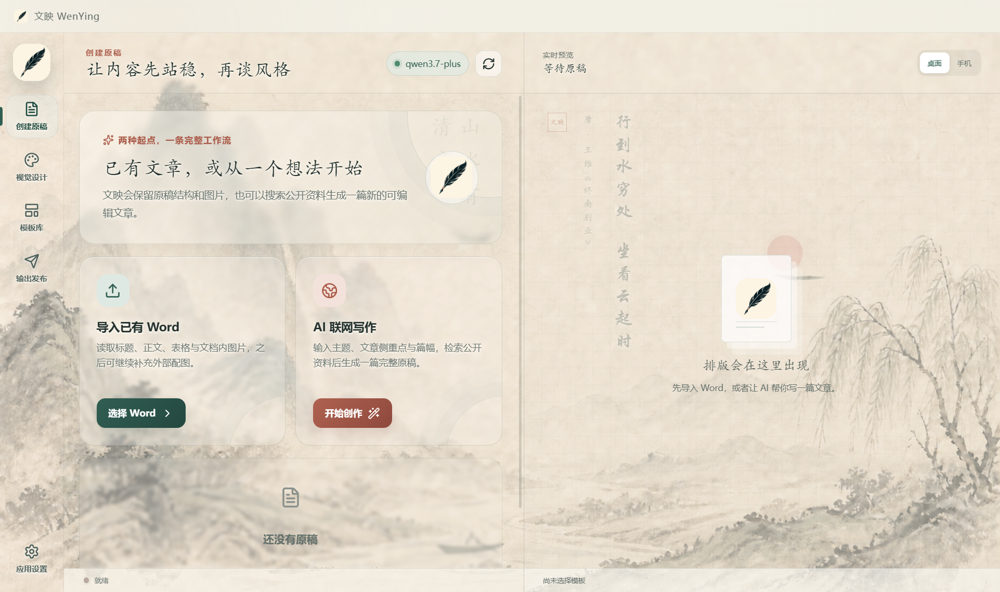
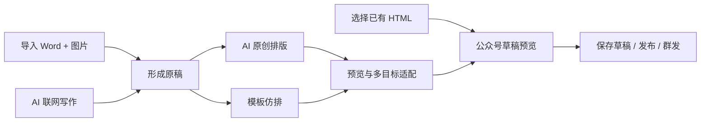
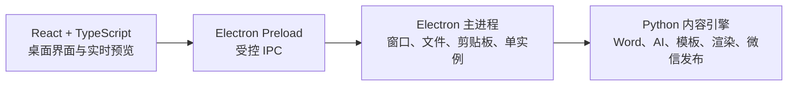

<p align="center">
  
</p>

<h1 align="center">文映 WenYing</h1>

<p align="center">
  让内容先站稳，再谈风格<br>
  面向 Windows 的 AI 图文写作、公众号排版与发布工作台
</p>

<p align="center">
  
  
  
  
  
</p>

<p align="center">
  
</p>

文映把一篇公众号文章从原稿到发布所需的环节集中到同一个桌面工作流中：导入 Word 与图片，或者让 AI 搜索公开资料并撰写原稿；随后使用 AI 原创设计或参考已有文章进行模板仿排，最后生成适合浏览器、135、秀米或微信公众号的 HTML。

应用采用水墨山水视觉语言，界面与生成文章彼此独立。工作台背景不会写进最终内容，文章始终按照你选择的风格单独设计。

> 默认情况下，AI 只参与版式设计，不修改原文。只有主动开启“AI 优化正文”后，模型才会润色文字。

## 核心能力

### 两种原稿入口

- **导入已有 Word**：读取标题、段落、表格与文档内图片，并可继续添加 Word 外部的配套图片。
- **AI 联网写作**：输入主题、关键词、文章类型、目标篇幅和侧重点，检索公开资料后生成一篇可继续编辑的原稿。

### 两种排版方式

- **AI 原创排版**：提供多种视觉风格和随机种子，同一份内容可以生成不同设计方案。
- **模板仿排**：通过公众号文章链接或页面截图学习颜色、标题层级、正文卡片、分隔线、固定页眉页脚与图片布局；模板可保存、复用和删除。

### 多目标 HTML 输出

| 输出目标 | 适用场景 |
| --- | --- |
| 自由网页 HTML | 浏览器展示，保留渐变、SVG、复杂背景和轻动画 |
| 135 编辑器代码 | 复制后继续在 135 编辑器中调整 |
| 秀米兼容代码 | 清理部分不兼容网页样式后导入秀米 |
| 微信公众号正文 | 按微信公众号更严格的 HTML/CSS 规则适配 |

输出目录可以在设置中修改，生成文件会自动使用文章标题命名。以前生成的 HTML 也可以直接选择并进入发布流程，无需再次调用 AI。

### 微信公众号发布

- 生成并打开公众号草稿预览。
- 自动上传正文图片并替换为微信素材地址。
- 保存到公众号草稿箱。
- 在账号具备权限时继续正式发布或群发。

建议始终先进入草稿箱检查手机端显示效果，再执行正式发布或群发。

## 使用流程



## 快速开始

### 环境要求

- Windows 10 或 Windows 11
- Node.js 22.12 或更高版本
- Python 3.10 或更高版本
- 一个兼容 OpenAI Chat Completions 接口的模型服务

图片理解、模板学习和智能配图需要模型支持多模态输入。一个能力完整的多模态模型即可覆盖当前 AI 功能。

### 获取并安装

```powershell
git clone https://github.com/XiuxianCoder/WenYing.git
cd WenYing

py -3.10 -m venv .venv
.\.venv\Scripts\Activate.ps1
python -m pip install --upgrade pip
python -m pip install -r requirements.txt
npm ci
```

如果 PowerShell 不允许激活虚拟环境，可以直接使用：

```powershell
.\.venv\Scripts\python.exe -m pip install -r requirements.txt
npm ci
```

### 启动应用

双击 `run_wenying.bat`，或者在项目目录执行：

```powershell
npm run build:web
npm run start
```

开发模式：

```powershell
npm run dev
```

> 当前源码版本仍需要本机 Python 环境。Electron 安装目录中包含内容引擎源码，但尚未内置独立 Python 运行时。

## 应用配置

点击左下角的“应用设置”即可完成所有本机配置。

### 多模态模型

| 配置项 | 说明 |
| --- | --- |
| API 服务地址 | OpenAI 兼容 Base URL，例如 `https://api.openai.com/v1` |
| 模型名称 | 服务商提供的模型 ID |
| API Key | 模型服务密钥 |
| HTML 输出目录 | 自动预览与导出文件的默认保存位置 |
| 界面字体 | 华文行楷、楷体或微软雅黑，保存后立即生效 |

### 微信公众号

1. 登录[微信公众平台](https://mp.weixin.qq.com/)。
2. 在“设置与开发 → 基本配置”或“开发接口管理”中获取 AppID 与 AppSecret。
3. 将运行文映电脑的公网出口 IPv4 加入公众号 IP 白名单。
4. 在文映中填写 AppID、AppSecret 和默认作者并保存。
5. 首次使用先测试连接，再发布到草稿箱预览。

如果出现 `40164 invalid ip, not in whitelist`，请核对错误信息中的出口 IP，而不是只查看电脑局域网地址。使用 VPN、代理或动态公网网络时，出口 IP 可能发生变化。

## 数据与隐私

文映采用本地优先设计：Word 解析、图片管理、模板存储和 HTML 渲染在本机完成。使用 AI、联网写作、网页模板学习或微信公众号接口时，相关内容才会发送到对应服务。

| 本地路径 | 内容 |
| --- | --- |
| `data/settings.json` | 模型与公众号配置，可能包含 API Key 和 AppSecret |
| `data/templates/` | 已保存的本地模板 |
| `data/wenying_error.log` | 本地错误日志 |
| `output/` | 默认 HTML、图片与预览输出 |

仓库不会提供 `settings.json`。首次启动时应用使用代码内置默认值；用户第一次保存设置后，文件才会自动创建。上述设置、模板、日志和输出目录均已被 `.gitignore` 排除。

请不要把 API Key、AppSecret、Access Token、客户素材、私人文章或未获授权的公众号资源提交到公开仓库。

## 技术架构



- 渲染进程不直接访问 Node.js、文件系统或 Python。
- Electron 主进程处理原生窗口、文件对话框、路径和剪贴板。
- `wenying_bridge.py` 通过 JSON Lines 与 Electron 通信。
- `wenying/` 只保留当前内容引擎实际使用的模块。

## 项目结构

```text
WenYing/
├─ electron/                 # Electron 主进程、Preload 与 Python 客户端
├─ src/                      # React + TypeScript 桌面界面
├─ wenying_bridge.py         # Electron 与 Python 的常驻通信引擎
├─ wenying/                  # Word、AI、模板、渲染与微信发布模块
├─ data/                     # 应用图标与界面视觉资源
├─ docs/                     # 项目图片与发布文档
├─ requirements.txt          # Python 依赖
├─ package.json              # Electron/React 依赖与构建脚本
└─ run_wenying.bat           # Windows 启动脚本
```

## 开发检查

```powershell
python -m compileall -q wenying_bridge.py wenying
npm run typecheck
npm run build:web
```

提交功能修改前，建议至少验证 Word 与外部图片导入、AI 联网写作、两种排版方式、四类 HTML 输出，以及公众号草稿预览。

## 当前限制

- 微信、135 和秀米可能继续清理部分 CSS，适配版不会与自由网页版本完全一致。
- 公众号文章页面可能限制采集，模板复刻效果取决于可获取内容和模型能力。
- AI 联网写作生成的事实、日期和引用仍需人工核验。
- 直接发布与群发取决于公众号认证状态、接口权限和额度。

## 参与项目

欢迎提交 Issue 和 Pull Request。反馈问题时，请尽量提供复现步骤、预期结果、实际结果、错误日志和已经脱敏的截图。

请勿在 Issue 中公开 API Key、AppSecret、真实用户数据或未获授权的公众号素材。

---

<p align="center">
  如果文映让你少在 Word、浏览器和公众号后台之间来回切换，<br>
  欢迎点亮右上角的 <strong>Star ⭐</strong>。
</p>
