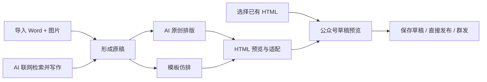
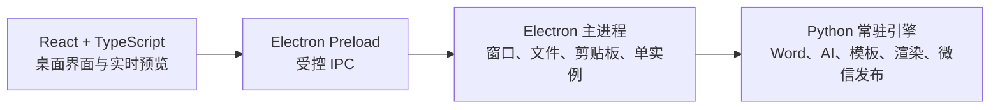

<p align="center">
  
</p>

<h1 align="center">文映 WenYing</h1>

<p align="center">
  面向 Windows 的 AI 图文写作、微信公众号排版与发布工具
</p>

<p align="center">
  
  
  
  
  
</p>

<p align="center">
  
</p>

<p align="center">
  <sub>水墨工作台 · Word 与 AI 双原稿入口 · 文章实时预览</sub>
</p>

---

文映将“准备原稿、设计排版、适配编辑器、发布公众号”整合到一个本地桌面工作流中。你可以导入已有 Word 与配套图片，也可以让 AI 联网检索资料并撰写新文章；随后使用 AI 原创设计或参考公众号模板生成 HTML，最后预览、导出或发送到微信公众号。

新版桌面端采用 **Electron + React + TypeScript**，并通过受控 IPC 调用现有 Python 内容引擎。界面与业务逻辑相互隔离，既保留已经稳定的 Word、AI、模板和微信发布能力，也获得更现代的布局、实时预览和桌面交互。

新版工作台使用宣纸、淡墨、远山、飞鸟、柳影与朱砂色构成视觉语言。左侧负责切换工作阶段，中间完成当前操作，右侧始终保留文章实时预览；内容可以滚动，背景和预览区域保持稳定，不再因为滚动条或弹窗改变布局宽度。

> 文映是本地优先工具，但不是完全离线工具。只有在使用 AI、联网写作、网页模板采集或微信发布时才会访问网络。调用 AI 时，相关文字或图片会发送给你配置的模型服务商。

## 为什么使用文映

| 需求 | 文映的处理方式 |
| --- | --- |
| 已经写好 Word，只想快速排版 | 保留文字与图片，AI 只负责设计版式；正文润色默认关闭 |
| 只有主题，还没有文章 | 搜索公开资料，按文章类型、篇幅和侧重点生成可继续编辑的原稿 |
| 喜欢某篇公众号的视觉风格 | 采集链接或截图，保存为本地模板后反复使用 |
| 想做更自由的视觉效果 | 生成适合浏览器展示的完整 HTML，同时提供 135、秀米和微信适配版本 |
| 不想每次重新生成再发布 | 直接选择已有 HTML，预览后保存到草稿箱、发布或群发 |

文映适合公众号运营、内容编辑、活动策划、技术作者，以及希望把“写作—排版—发布”集中到一处的个人和小团队。

## 新版工作台

| 工作区 | 用途 |
| --- | --- |
| 创建原稿 | 导入 Word 与图片，或使用 AI 联网检索并写作 |
| 视觉设计 | 选择原创风格、随机种子和正文优化策略 |
| 模板库 | 采集、学习、保存、复用和删除公众号排版模板 |
| 输出发布 | 生成自由网页、135、秀米、微信正文，并发布到公众号 |
| 应用设置 | 配置模型、输出目录、界面字体和微信公众号接口 |

界面中的水墨山水仅作为桌面端氛围层，不会写入文章内容；生成的 HTML 会按照所选风格独立设计。随机种子只参与内部版式变化，不会显示在最终文章中。

## 功能亮点

### 两种原稿来源

- **已有文章排版**：解析 `.docx` 中的标题、段落、图片与表格，并可补充 Word 外部的配套图片。
- **AI 联网写作**：围绕主题搜索公开资料，按文章类型、目标篇幅、侧重点和自由要求生成新原稿。
- 支持技术教程、代码实战、行业分析、资讯综述、活动推文等文章类型。
- AI 代码内容以独立代码块保存并渲染，保留缩进与换行。

### 两种排版方式

- **AI 原创排版**：多种视觉风格、随机种子、可选正文润色；默认严格保留原文。
- **模板仿排**：通过公众号文章链接、内嵌浏览器采集或截图学习排版，模板可保存、复用和删除。
- 支持标题、正文卡片、分隔线、固定页眉页脚、图片布局和动态网页装饰。

### 多目标 HTML 输出

- 自由网页 HTML
- 135 编辑器代码
- 秀米兼容代码
- 微信公众号正文
- 输出目录可配置，文件自动按文章标题命名。
- 可直接选择以前生成的 HTML 发布，无需重新调用 AI。

### 微信公众号发布

- 本地预览微信兼容版草稿。
- 上传正文图片并自动替换为微信素材 URL。
- 保存到公众号草稿箱。
- 在账号具备权限时直接发布，或群发给全部关注用户。
- 发布与群发均有独立入口和高风险二次确认。

## 工作流



## 技术架构



- React 渲染进程不直接访问 Node.js、文件系统或 Python。
- Electron 主进程统一处理原生窗口、文件对话框、路径与剪贴板。
- `wenying_bridge.py` 使用 JSON Lines 与 Electron 通信，并复用 `wenying/` 下的稳定功能模块。
- 原有 Tkinter 版仍可通过 `run_wenying_legacy.bat` 启动，便于迁移期间回退验证。

## 环境要求

- Windows 10 或 Windows 11
- Node.js 22.12 或更高版本
- Python 3.10 或更高版本
- 一个 OpenAI Chat Completions 兼容的模型 API
- 模板图片理解与智能配图需要支持图片输入的多模态模型
- 微信发布功能需要公众号 AppID、AppSecret、IP 白名单及相应接口权限

一个能力完整的多模态模型即可覆盖当前 AI 功能。

## 快速开始

### 1. 获取项目

在 GitHub 页面选择 **Code → Download ZIP**，或复制仓库地址后克隆：

```powershell
git clone <repository-url>
cd WenYing
```

将 `<repository-url>` 替换为 GitHub 页面中显示的 HTTPS 或 SSH 地址。

### 2. 安装 Python 与 Electron 依赖

```powershell
py -3.10 -m venv .venv
.\.venv\Scripts\Activate.ps1
python -m pip install --upgrade pip
python -m pip install -r requirements.txt
npm ci
```

若 PowerShell 阻止激活脚本，可以直接使用：

```powershell
.\.venv\Scripts\python.exe -m pip install -r requirements.txt
npm ci
```

### 3. 启动应用

双击：

```text
run_wenying.bat
```

双击脚本会启动新版 Electron 桌面端。开发模式可以运行：

```powershell
npm run dev
```

如需临时回到旧版 Tkinter 界面，可双击 `run_wenying_legacy.bat`。

## 配置模型

点击左下角“应用设置”，在“多模态模型”区域填写：

| 配置项 | 说明 |
| --- | --- |
| 模型 API 服务地址 | OpenAI 兼容 Base URL，例如 `https://api.openai.com/v1` |
| 模型名称 | 服务商提供的模型 ID |
| API Key | 模型服务密钥 |
| HTML 输出目录 | 自动预览与导出的默认保存目录 |
| 界面字体 | 华文行楷（默认）或楷体，保存后立即生效 |

模型最好同时支持：文本理解、图片输入、较长上下文和 JSON 结构化输出。

## 配置微信公众号

1. 登录 [微信公众平台](https://mp.weixin.qq.com/)。
2. 进入“设置与开发 → 基本配置”或“开发接口管理”。
3. 获取公众号 **AppID** 与 **AppSecret**。
4. 将运行文映电脑或服务器的公网出口 IPv4 加入 **IP 白名单**。
5. 在文映左下角“应用设置”的“微信公众号接口”区域填写 AppID、AppSecret 和默认作者。
6. 首次使用建议先选择“预览微信草稿”，再保存到草稿箱检查。

常见错误：

- `40164 invalid ip, not in whitelist`：当前公网出口 IP 未加入公众号 IP 白名单。
- 获取不到 `access_token`：检查 AppID、AppSecret、账号类型、开发接口状态和白名单。
- 无权直接发布或群发：公众号认证类型或接口权限不满足要求。

> AppSecret 是高敏感凭证。不要截图、分享或提交到 GitHub。重置 AppSecret 后，旧密钥会立即失效。

## 输出与数据目录

| 路径 | 内容 |
| --- | --- |
| `data/settings.json` | 本机模型与公众号配置，包含敏感密钥，已被 `.gitignore` 忽略 |
| `data/templates/` | 本地学习与生成的模板 |
| `data/wenying_error.log` | 本地运行错误日志 |
| `output/` | 默认 HTML、图片与预览输出；可在设置中更改 |

仓库不会提供 `settings.json`。首次启动时应用直接使用代码内置的安全默认值，因此该文件不存在不会影响界面启动、Word 导入和本地预览；当用户在“应用设置”中第一次点击保存后，应用会自动创建并写入配置文件。源码运行时文件位于项目的 `data/settings.json`，安装版则保存在 Electron 用户数据目录中，不会写进安装目录。

自动预览文件采用以下命名：

```text
文章标题_预览.html
文章标题_公众号草稿预览.html
```

## 微信 HTML 兼容性

自由网页 HTML 可以使用渐变、SVG、卡片、复杂背景和轻动画。公众号、135 和秀米对 HTML/CSS 的支持更严格，文映会生成适配版本并移除不兼容的脚本、动画、定位和部分高级 CSS。

因此：

- 浏览器中的自由网页版本通常视觉效果最完整。
- 公众号适配版会优先保证内容、图片和核心样式稳定。
- 最终发布前应始终使用草稿预览并在公众号后台检查。

## 安全与隐私

- Word 解析、图片管理、模板存储和 HTML 渲染在本机完成。
- AI 功能会把必要的文本、页面摘要或图片发送给所配置的模型服务商。
- 联网写作会访问公开搜索结果和网页资料，生成事实仍需人工核验。
- API Key 与 AppSecret 当前以本机 JSON 文件保存，并非系统密钥链加密存储。
- `.gitignore` 默认排除设置、日志、采集缓存、输出文件和用户样稿；提交前仍建议执行 `git status` 检查。

## 项目结构

```text
WenYing/
├─ electron/                 # Electron 主进程、Preload 与 Python 客户端
├─ src/                      # React + TypeScript 新界面
├─ index.html                # Vite 页面入口
├─ package.json              # Electron/React 依赖与构建脚本
├─ wenying_bridge.py         # Electron 与 Python 的常驻通信引擎
├─ run_wenying.bat           # 新版 Electron 启动脚本
├─ run_wenying_legacy.bat    # 旧版 Tkinter 备用启动脚本
├─ app.py                    # 旧版入口与单实例保护
├─ requirements.txt          # Python 依赖
├─ wenying/
│  ├─ app_window.py          # 旧版 Tkinter 界面
│  ├─ docx_parser.py         # Word 解析
│  ├─ research_writer.py     # 联网检索与 AI 写作
│  ├─ learning_v2.py         # 模板学习与原创排版
│  ├─ renderer_v3.py         # HTML 渲染
│  ├─ wechat_adapter.py      # 135 / 秀米 / 公众号适配
│  └─ wechat_publisher.py    # 微信素材、草稿、发布与群发接口
├─ data/                     # 图标和本机运行数据
└─ output/                   # 默认输出目录
```

## 开发检查

```powershell
python -m compileall -q app.py wenying_bridge.py wenying
npm run typecheck
npm run build:web
```

提交前请至少验证：

- Word 与外部图片导入
- AI 联网写作与代码块
- AI 原创排版和模板仿排
- 四种 HTML 输出目标
- 已有 HTML 直接发布
- 微信草稿预览和草稿箱上传

## 发布到 GitHub

### 首次发布源码

先在 GitHub 创建一个空仓库，例如 `WenYing`。不要勾选自动生成 README、`.gitignore` 或 License，然后在项目根目录执行：

```powershell
git init
git branch -M main
git add .gitignore README.md README_EN.md
git add package.json package-lock.json index.html tsconfig.json vite.config.ts
git add requirements.txt app.py wenying_bridge.py run_wenying.bat run_wenying_legacy.bat
git add wechat_template_learning_prd.md src electron wenying
git add data/wenying.ico data/wenying-icon.png data/wenying-icon-source.png
git add data/wenying-shanshui-v1.png data/wenying-shanshui-v2.png data/wenying-shanshui-v3.png
git add docs/images/wenying-workbench.png
git status
git commit -m "feat: publish WenYing desktop"
git remote add origin https://github.com/<你的用户名>/WenYing.git
git push -u origin main
```

将 `<你的用户名>` 替换为自己的 GitHub 用户名。如果仓库已经配置过 `origin`，使用：

```powershell
git remote set-url origin https://github.com/<你的用户名>/WenYing.git
git push -u origin main
```

### 后续更新

```powershell
git add README.md README_EN.md src electron wenying wenying_bridge.py
git add package.json package-lock.json requirements.txt
git add data/wenying.ico data/wenying-icon.png data/wenying-icon-source.png
git add data/wenying-shanshui-v1.png data/wenying-shanshui-v2.png data/wenying-shanshui-v3.png
git add docs/images/wenying-workbench.png
git status
git commit -m "feat: improve WenYing"
git push
```

### 创建版本标签

```powershell
git tag -a v0.2.0 -m "WenYing v0.2.0"
git push origin v0.2.0
```

标签推送完成后，可以在 GitHub 的 **Releases → Draft a new release** 中选择 `v0.2.0`，填写更新说明并发布源码版本。

> 当前桌面端仍需要本机 Python 环境与依赖。若要发布可在其他 Windows 电脑直接安装运行的安装包，还需要先把 Python 解释器和依赖打包为应用 sidecar；不要把目前的 Electron 目录包误标为完全独立安装版。

### 公开仓库前检查

```powershell
git status --short
git status --ignored
git diff --cached --name-only
```

确认以下内容没有进入待提交列表：

- `data/settings.json`
- API Key、AppSecret、Access Token
- `data/templates/` 与浏览器采集缓存
- `output/` 中生成的文章和图片
- 测试 Word、客户素材、二维码及其他未获授权文件

项目已经通过 `.gitignore` 排除上述常见本地数据，但首次公开前仍应人工核对一次 `git status`。

## 已知限制

- 微信、135、秀米可能继续清理部分 CSS，效果不会与自由网页完全一致。
- 公众号文章页面可能限制抓取，模板复刻效果受采集数据和模型能力影响。
- 动态公网 IP 变化后，需要同步更新公众号 IP 白名单。
- 直接发布和群发取决于公众号的认证状态、接口权限与额度；请谨慎测试。

## 贡献

欢迎提交 Issue 和 Pull Request。提交问题时请提供：复现步骤、预期结果、实际结果、错误日志，以及已脱敏的截图。请勿上传 API Key、AppSecret、真实用户数据或未获授权的公众号素材。

---

<p align="center">
  如果文映让你少在 Word、浏览器和公众号后台之间来回折腾，<br>
  欢迎点亮右上角的 <strong>Star ⭐</strong>。你的支持会让这个项目继续变得更稳定、更好用。
</p>
