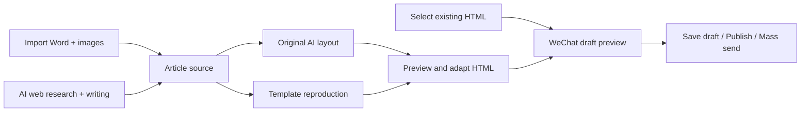
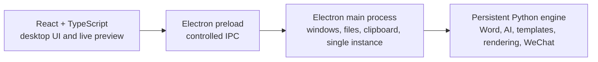

<p align="center">
  
</p>

<h1 align="center">WenYing</h1>

<p align="center">
  AI-assisted writing, WeChat article design, and publishing for Windows
</p>

<p align="center">
  
  
  
  
  
</p>

<p align="center">
  <a href="README.md">中文</a> · English
</p>

---

WenYing combines source preparation, visual design, editor adaptation, and WeChat Official Account publishing in a local desktop workflow. Import an existing Word document and its images, or let AI research public sources and draft a new article. Then create an original AI layout or reproduce a reference template before previewing, exporting, or publishing the result.

The new desktop client uses **Electron + React + TypeScript** and calls the established Python content engine through a controlled IPC bridge. UI and business logic stay separated: the Word, AI, template, rendering, and WeChat workflows remain reusable while the desktop experience gains a modern workspace and live preview.

> WenYing is local-first, not fully offline. Network access is used only for AI features, web research, template capture, and WeChat publishing. Text and images required by an AI task are sent to the model provider you configure.

## Why WenYing

| What you need | How WenYing helps |
| --- | --- |
| Format an article already written in Word | Preserve text and images while AI designs the layout; copy editing is off by default |
| Turn a topic into a complete draft | Research public sources and write to a selected article type, length, focus, and custom brief |
| Reuse the look of a WeChat article | Capture a URL or screenshots, save the result locally, and reuse it as a template |
| Create richer visual designs | Generate full browser HTML plus adapted variants for 135 Editor, Xiumi, and WeChat |
| Publish an earlier result without regenerating it | Select an existing HTML file, preview it, then save, publish, or mass-send it |

WenYing is designed for WeChat operators, editors, campaign teams, technical writers, and individuals who want one place for writing, layout, and publishing.

## Highlights

### Two source workflows

- **Format an existing article**: parse headings, paragraphs, images, and tables from `.docx`, then add companion images stored outside the document.
- **AI web research and writing**: search public sources and draft an article based on its type, length, focus, and custom instructions.
- Includes technical tutorials, code walkthroughs, industry analysis, news roundups, event posts, and more.
- Code is stored as real code blocks with indentation and line breaks preserved.

### Two layout workflows

- **Original AI layout**: multiple visual directions, creative seeds, and optional copy editing. Source text is preserved by default.
- **Template reproduction**: learn from a WeChat article URL, embedded browser capture, or screenshots. Templates can be saved, reused, and deleted.
- Supports structured headings, cards, separators, fixed header/footer assets, image placement, and browser-only motion effects.

### Multiple HTML targets

- Full browser HTML
- 135 Editor code
- Xiumi-compatible code
- WeChat article body
- Configurable output folder and title-based filenames
- Publish an existing HTML file without running AI again

### WeChat Official Account publishing

- Preview the WeChat-compatible draft locally.
- Upload body images and replace them with WeChat-hosted URLs.
- Save to the Official Account draft box.
- Directly publish or mass-send when the account has the required permission.
- Separate actions and explicit confirmation for high-risk publishing operations.

## Workflow



## Architecture



- The React renderer never accesses Node.js, the filesystem, or Python directly.
- Electron owns native windows, file dialogs, paths, clipboard access, and application lifecycle.
- `wenying_bridge.py` communicates with Electron over JSON Lines and reuses the stable modules under `wenying/`.

## Requirements

- Windows 10 or Windows 11
- Node.js 22.12+
- Python 3.10+
- An OpenAI Chat Completions-compatible model API
- A multimodal model with image input for template analysis and intelligent image placement
- For WeChat publishing: AppID, AppSecret, an IP whitelist, and the required Official Account API permissions

A single capable multimodal model is enough for the current AI workflows.

## Quick start

### 1. Get the project

Choose **Code → Download ZIP** on GitHub, or copy the repository URL and clone it:

```powershell
git clone <repository-url>
cd WenYing
```

Replace `<repository-url>` with the HTTPS or SSH address shown on the GitHub page.

### 2. Install Python and Electron dependencies

```powershell
py -3.10 -m venv .venv
.\.venv\Scripts\Activate.ps1
python -m pip install --upgrade pip
python -m pip install -r requirements.txt
npm install
```

If PowerShell blocks environment activation, use the interpreter directly:

```powershell
.\.venv\Scripts\python.exe -m pip install -r requirements.txt
npm install
```

### 3. Start WenYing

Double-click:

```text
run_wenying.bat
```

The batch file starts the new Electron desktop client. For development, run:

```powershell
npm run dev
```

## Model configuration

Open **Application Settings** from the lower-left navigation and configure the multimodal model section:

| Field | Description |
| --- | --- |
| Model API endpoint | OpenAI-compatible base URL, for example `https://api.openai.com/v1` |
| Model name | Model ID provided by your vendor |
| API Key | Model service credential |
| HTML output folder | Default location for automatic previews and exports |
| UI font | STXingkai by default, or KaiTi; applied immediately |

For best results, use a model with text understanding, image input, a large context window, and structured JSON output.

## WeChat configuration

1. Sign in to the [WeChat Official Accounts Platform](https://mp.weixin.qq.com/).
2. Open **Settings & Development → Basic Configuration** or the developer interface section.
3. Obtain the Official Account **AppID** and **AppSecret**.
4. Add the public outbound IPv4 address of the WenYing computer or server to the **IP whitelist**.
5. Enter the AppID, AppSecret, and default author in the WeChat section of **Application Settings**.
6. For the first test, preview the WeChat draft and save it to the draft box before publishing.

Common errors:

- `40164 invalid ip, not in whitelist`: the current outbound IP is not in the Official Account IP whitelist.
- No `access_token`: verify the AppID, AppSecret, account type, developer access, and whitelist.
- Publish or mass-send permission denied: the account certification or API permission is insufficient.

> AppSecret is a highly sensitive credential. Never share it, include it in screenshots, or commit it to GitHub. Resetting it invalidates the previous secret immediately.

## Local data and output

| Path | Purpose |
| --- | --- |
| `data/settings.json` | Local model and WeChat configuration, including secrets; ignored by Git |
| `data/templates/` | Learned and generated local templates |
| `data/wenying_error.log` | Local runtime error log |
| `output/` | Default HTML, asset, and preview output; configurable in settings |

Automatic preview filenames include the article title:

```text
Article title_预览.html
Article title_公众号草稿预览.html
```

## HTML compatibility

Full browser HTML may use gradients, SVG decoration, cards, layered backgrounds, and subtle animation. WeChat, 135, and Xiumi support a more restricted HTML/CSS subset. WenYing creates adapted variants by removing scripts, animations, positioning, and unsupported advanced CSS.

As a result:

- The full browser version usually has the richest visual design.
- Editor and WeChat variants prioritize stable text, images, and core styling.
- Always inspect the draft preview and the final draft inside the WeChat backend.

## Security and privacy

- Word parsing, image management, template storage, and HTML rendering happen locally.
- AI tasks send the necessary text, page excerpts, or images to the configured model provider.
- Web research reads public search results and pages; generated facts still require human verification.
- API Key and AppSecret are currently stored in a local JSON file, not an OS credential vault.
- `.gitignore` excludes local settings, logs, capture cache, generated output, and sample user documents. Always run `git status` before publishing.

## Project structure

```text
WenYing/
├─ electron/                 # Electron main process, preload, and Python client
├─ src/                      # React + TypeScript desktop interface
├─ index.html                # Vite page entry
├─ package.json              # Electron/React dependencies and build scripts
├─ wenying_bridge.py         # Persistent Electron-to-Python engine
├─ run_wenying.bat           # New Electron launcher
├─ requirements.txt          # Python dependencies
├─ wenying/
│  ├─ docx_parser.py         # Word parser
│  ├─ research_writer.py     # Web research and AI writing
│  ├─ learning_v2.py         # Template learning and original design
│  ├─ renderer_v3.py         # HTML renderer
│  ├─ wechat_adapter.py      # 135 / Xiumi / WeChat adaptation
│  └─ wechat_publisher.py    # WeChat assets, drafts, publish, and mass-send APIs
├─ data/                     # Icons and local runtime data
└─ output/                   # Default output directory
```

## Development check

```powershell
python -m compileall -q wenying_bridge.py wenying
npm run typecheck
npm run build:web
```

Before submitting a change, verify at least:

- Word and external image import
- AI web writing and code blocks
- Original AI design and template reproduction
- All four HTML targets
- Publishing an existing HTML file
- WeChat draft preview and draft upload

## Known limitations

- WeChat, 135, and Xiumi may apply additional CSS sanitization, so their output cannot exactly match full browser HTML.
- Some WeChat pages restrict scraping; template fidelity depends on captured data and model capability.
- A dynamic public IP must be updated in the WeChat IP whitelist whenever it changes.
- Direct publishing and mass sending depend on account certification, API permissions, and quotas. Test carefully.

## Contributing

Issues and pull requests are welcome. Include reproducible steps, expected and actual behavior, sanitized screenshots, and relevant logs. Never upload API keys, AppSecrets, real user data, or copyrighted WeChat materials without permission.

---

<p align="center">
  If WenYing saves you from constantly switching between Word, the browser, and the WeChat backend,<br>
  please consider leaving a <strong>Star ⭐</strong>. It helps the project keep improving.
</p>
